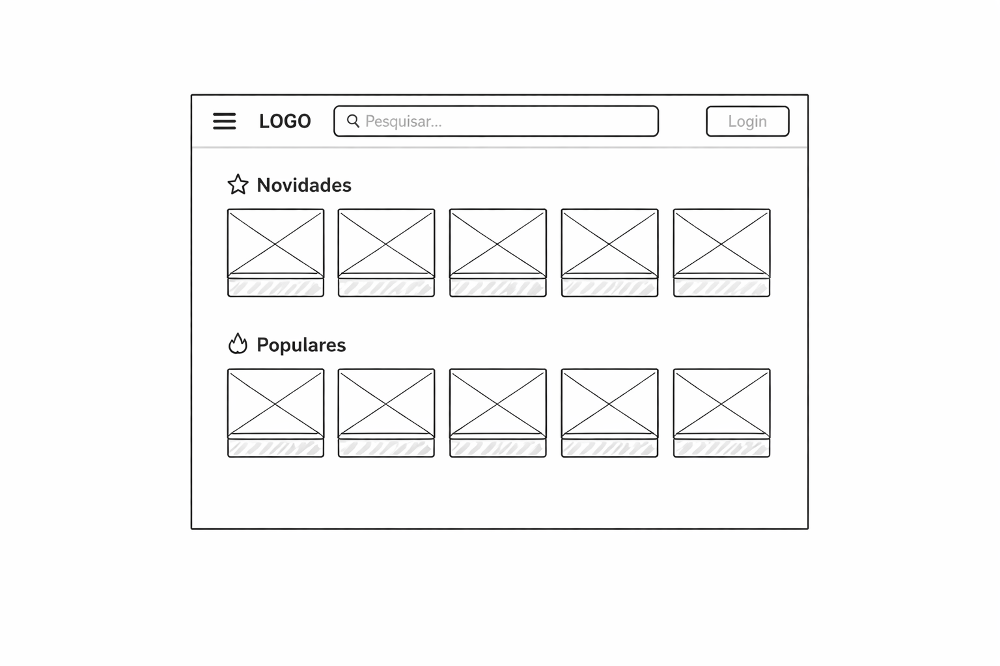
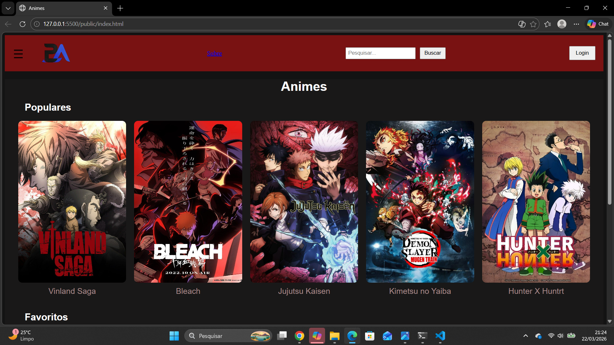

# Trabalho Prático - Semana 04

Dessa vez, vamos escolher uma proposta de projeto para trabalhar.

Nessa atividade, você deverá montar a página inicial do projeto escolhido, a organização do HTML aplicando semântica correta e uso aprimorado do CSS. Leia o enunciado completo no Canvas para mais detalhes.

**IMPORTANTE:** Você deve trabalhar e alterar apenas arquivos dentro da pasta **`public`**. Deixe todos os demais arquivos e pastas desse repositório inalterados. **PRESTE MUITA ATENÇÃO NISSO.**

## Informações Gerais

- Nome: Paulo Henrique Pereira de Souza
- Matricula: 906623
- Proposta de projeto escolhida: Site para assistir animes
- Breve descrição sobre seu projeto: Sempre tive interesse em animes, então decidi criar algo que eu mesmo gostaria de utilizar.

## Print do(s) wireframe(s) criado

## Print da home-page criada

